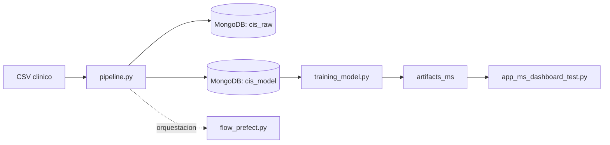

# Proyecto Final de Administracion de Datos

## Descripcion del problema y objetivo

Este proyecto trabaja con un problema de apoyo a la decision clinica: **predecir la conversion de pacientes con CIS a esclerosis multiple**.

`CIS` significa `Clinically Isolated Syndrome` o `sindrome clinicamente aislado`. Se refiere a un primer episodio neurologico compatible con desmielinizacion del sistema nervioso central. No todos los pacientes con CIS desarrollan esclerosis multiple, por lo que resulta util identificar variables clinicas y paraclinicas asociadas con esa conversion.

El dataset utilizado proviene de Kaggle y resume una **cohorte prospectiva de pacientes mestizos mexicanos** con diagnostico reciente de CIS, atendidos en el **National Institute of Neurology and Neurosurgery (NINN)** en Ciudad de Mexico entre **2006 y 2010**. Segun la descripcion del dataset, estudios previos han reportado tasas de conversion de CIS a esclerosis multiple en rangos aproximados de **30% a 82%**, lo que justifica el interes por encontrar predictores tempranos.

El objetivo del proyecto es construir una solucion de datos completa que permita:

- cargar los datos clinicos originales a MongoDB,
- transformarlos y dejarlos listos para modelado,
- entrenar modelos de clasificacion para predecir conversion,
- generar artefactos para analisis,
- y exponer resultados en un dashboard interactivo.

Fuentes consultadas para esta descripcion:

- Kaggle: [Multiple Sclerosis Disease](https://www.kaggle.com/datasets/desalegngeb/conversion-predictors-of-cis-to-multiple-sclerosis)
- PubMed: [Conversion Predictors of Clinically Isolated Syndrome to Multiple Sclerosis in Mexican Patients: A Prospective Study](https://pubmed.ncbi.nlm.nih.gov/37429750/)

## Arquitectura



### Componentes principales

- [pipeline.py](/d:/Repositorios/proyecto_final_admin_datos/pipeline.py): ejecuta el ETL principal.
- [flow_prefect.py](/d:/Repositorios/proyecto_final_admin_datos/flow_prefect.py): orquesta la ejecucion del pipeline con Prefect.
- [training_model.py](/d:/Repositorios/proyecto_final_admin_datos/training_model.py): entrena y evalua modelos de clasificacion.
- [app_ms_dashboard_test.py](/d:/Repositorios/proyecto_final_admin_datos/app_ms_dashboard_test.py): dashboard en Streamlit para visualizacion y prediccion.
- [ml_toolkit.py](/d:/Repositorios/proyecto_final_admin_datos/ml_toolkit.py): utilidades de entrenamiento, evaluacion y validacion.
- [artifacts_ms](/d:/Repositorios/proyecto_final_admin_datos/artifacts_ms): salida de metricas, modelo, importancia de variables y datos para el dashboard.

## Fuente de datos

### Dataset base

- Nombre: `Conversion Predictors of Clinically Isolated Syndrome to Multiple Sclerosis`
- Origen: Kaggle
- Enlace: [desalegngeb/conversion-predictors-of-cis-to-multiple-sclerosis](https://www.kaggle.com/datasets/desalegngeb/conversion-predictors-of-cis-to-multiple-sclerosis)

### Archivo utilizado en el proyecto

- Archivo CSV original: `conversion_predictors_of_clinically_isolated_syndrome_to_multiple_sclerosis.csv`
- Ruta esperada por el proyecto: `data/conversion_predictors_of_clinically_isolated_syndrome_to_multiple_sclerosis.csv`

### Tablas / colecciones utilizadas

El proyecto trabaja con MongoDB y utiliza dos colecciones principales:

- `cis_raw`: contiene la carga cruda del CSV.
- `cis_model`: contiene la tabla final ya transformada para entrenamiento y analitica.

### Variables relevantes del dataset

Segun la descripcion del dataset en Kaggle, las variables incluyen:

- demografia: `Age`, `Gender`, `Schooling`
- antecedentes o informacion clinica: `Breastfeeding`, `Varicella`
- sintomas iniciales: `Initial_Symptom`, `Mono_or_Polysymptomatic`
- hallazgos de laboratorio o potenciales evocados: `Oligoclonal_Bands`, `LLSSEP`, `ULSSEP`, `VEP`, `BAEP`
- hallazgos de imagen: `Periventricular_MRI`, `Cortical_MRI`, `Infratentorial_MRI`, `Spinal_Cord_MRI`
- escalas clinicas: `Initial_EDSS`, `Final_EDSS`
- target: `Group`

En el proyecto, la columna objetivo es `group`, donde:

- `1 = CDMS` o conversion a esclerosis multiple
- `2 = non-CDMS`

Durante el pipeline, esta variable se transforma a binario para modelado:

- `1 -> 1`
- `2 -> 0`

## ETL: pasos y logica principal

La logica ETL se implementa en [pipeline.py](/d:/Repositorios/proyecto_final_admin_datos/pipeline.py) en dos etapas.

### Etapa 1: carga cruda

1. Se lee el CSV original.
2. Se establece conexion con MongoDB.
3. Se limpia la coleccion `cis_raw`.
4. Se insertan los registros sin transformar.

Resultado:

- una copia cruda de los datos queda almacenada en `cis_raw`.

### Etapa 2: transformacion y carga para modelado

Sobre los datos leidos desde `cis_raw`, el pipeline aplica la siguiente logica:

- conversion de columnas clinicas y numericas a formato numerico,
- eliminacion de duplicados exactos,
- eliminacion de la columna tecnica `Unnamed: 0`,
- eliminacion de `Initial_EDSS` y `Final_EDSS` por riesgo de leakage,
- imputacion de `Schooling` con la mediana,
- imputacion de `Initial_Symptom` con `-1`,
- transformacion del target `group` desde `1/2` a `1/0`,
- construccion de la variable derivada `age_group`,
- one-hot encoding de `age_group`,
- carga del resultado final en `cis_model`.

Resultado:

- `cis_model` queda lista para pasar a entrenamiento.

## Orquestacion: como se ejecuta y evidencia

La orquestacion se realiza con Prefect mediante [flow_prefect.py](/d:/Repositorios/proyecto_final_admin_datos/flow_prefect.py).

### Como funciona

- se define una tarea `run_pipeline()`
- esa tarea ejecuta `pipeline.py` usando el mismo interprete de Python
- el flow `etl_ms_flow` encapsula la corrida del ETL

### Evidencia de ejecucion

La ejecucion deja evidencia en varios niveles:

- logs en consola del pipeline con cada etapa y tiempos de ejecucion,
- documentos cargados en `cis_raw`,
- documentos transformados en `cis_model`,
- artefactos generados posteriormente en [artifacts_ms](/d:/Repositorios/proyecto_final_admin_datos/artifacts_ms).

## Modelo IA

### Tipo de modelo

El problema es de **clasificacion binaria supervisada**: predecir si un paciente con CIS convertira o no a esclerosis multiple.

En [training_model.py](/d:/Repositorios/proyecto_final_admin_datos/training_model.py) se entrenan y comparan varios modelos:

- `LogisticRegression`
- `RandomForestClassifier`
- `SVC`
- `XGBClassifier` si `xgboost` esta disponible
- `LGBMClassifier` si `lightgbm` esta disponible

Ademas, el flujo contempla:

- particion `train/test`,
- escalado de variables para entrenamiento,
- validacion cruzada,
- ajuste de hiperparametros para el mejor modelo,
- exportacion de metricas y artefactos.

### Variables principales

Las variables principales provienen de la tabla `cis_model` y excluyen columnas que se consideraron problematica o leakage. En general, el modelo trabaja con:

- edad y escolaridad,
- sexo,
- lactancia materna,
- antecedente de varicela,
- sintomas iniciales,
- condicion mono/polisintomatica,
- bandas oligoclonales,
- potenciales evocados,
- hallazgos de MRI,
- variables derivadas como `age_group_*`.

Las variables de mayor peso final pueden revisarse en:

- [feature_importance.csv](/d:/Repositorios/proyecto_final_admin_datos/artifacts_ms/feature_importance.csv)

### Metrica de evaluacion

La metrica principal usada para seleccionar el mejor modelo es:

- `ROC_AUC_Pos`

Tambien se reportan otras metricas:

- `Accuracy`
- `Precision`
- `Recall`
- `F1`
- matriz de confusion

Resumen de resultados:

- [metrics_summary.csv](/d:/Repositorios/proyecto_final_admin_datos/artifacts_ms/metrics_summary.csv)
- [best_model_metrics.json](/d:/Repositorios/proyecto_final_admin_datos/artifacts_ms/best_model_metrics.json)

### Interpretacion de resultados

La interpretacion del modelo se apoya en:

- la comparacion de metricas por modelo,
- la importancia de variables,
- la curva ROC,
- la matriz de confusion,
- y el dashboard de Streamlit.

En un contexto clinico, se presta especial atencion a `Recall`, ya que ayuda a reducir falsos negativos en pacientes con posible conversion. Aun asi, estos resultados deben entenderse como una solucion academica y de apoyo, no como sustituto de juicio clinico ni validacion externa.

## Instrucciones para correr el proyecto

### 1. Clonar el repositorio

```powershell
git clone <url-del-repositorio>
cd proyecto_final_admin_datos
```

### 2. Crear y activar entorno virtual

En Windows PowerShell:

```powershell
python -m venv .venv
.\.venv\Scripts\Activate.ps1
```

### 3. Instalar dependencias

```powershell
pip install -r requirements.txt
```

### 4. Configurar variables de entorno

Crear un archivo `.env` en la raiz del proyecto con una configuracion similar a esta:

```env
MONGO_URI=mongodb://localhost:27017
MONGO_DB_NAME=ms_data
MONGO_COLLECTION_RAW=cis_raw
MONGO_COLLECTION_MODEL=cis_model
CSV_PATH=data/conversion_predictors_of_clinically_isolated_syndrome_to_multiple_sclerosis.csv
```

### 5. Descargar o ubicar el dataset

Descargar el CSV desde Kaggle y colocarlo en:

```text
data/conversion_predictors_of_clinically_isolated_syndrome_to_multiple_sclerosis.csv
```

### 6. Ejecutar el pipeline ETL

Opcion directa:

```powershell
python pipeline.py
```

O usando el entorno virtual explicitamente:

```powershell
.\.venv\Scripts\python.exe pipeline.py
```

### 7. Ejecutar la orquestacion con Prefect

```powershell
python flow_prefect.py
```

### 8. Entrenar los modelos

```powershell
python training_model.py
```

Esto genera artefactos en la carpeta:

```text
artifacts_ms/
```

### 9. Ejecutar el dashboard

```powershell
streamlit run app_ms_dashboard_test.py
```

## Salidas esperadas

Despues de correr el flujo completo, deberias contar con:

- datos crudos en `cis_raw`
- datos transformados en `cis_model`
- modelo entrenado en `artifacts_ms/best_model.pkl`
- metricas en `artifacts_ms/metrics_summary.csv`
- importancia de variables en `artifacts_ms/feature_importance.csv`
- curva ROC en `artifacts_ms/roc_curve_data.csv`
- metadatos para prediccion en `artifacts_ms/feature_columns.json`

## Archivos de apoyo

- [report.md](/d:/Repositorios/proyecto_final_admin_datos/report.md): resume hallazgos del EDA y decisiones aplicadas al pipeline.
- [pipeline.py](/d:/Repositorios/proyecto_final_admin_datos/pipeline.py): ETL principal.
- [training_model.py](/d:/Repositorios/proyecto_final_admin_datos/training_model.py): entrenamiento y evaluacion.
- [flow_prefect.py](/d:/Repositorios/proyecto_final_admin_datos/flow_prefect.py): orquestacion.
- [app_ms_dashboard_test.py](/d:/Repositorios/proyecto_final_admin_datos/app_ms_dashboard_test.py): dashboard final.
